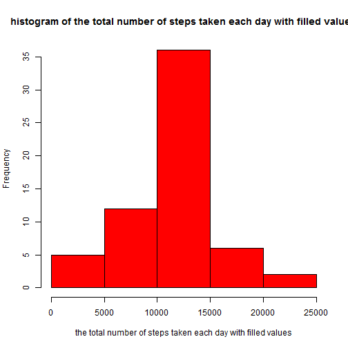

# Reproducible Research: Peer Assessment 1
This assignment is completed by liuyuankai from china.  
The steps of completing assignment and the answers of questions are described below.

## Loading and preprocessing the data
1. Load the data using read.csv() function.  
Assuming data is in the ./data directory, and "./" is current workding direstory.  

```r
data <- read.csv("./data/activity.csv",stringsAsFactors = F)
```


## What is mean total number of steps taken per day?
For this part of the assignment, the missing values in the dataset is ignored.  
1. Make a histogram of the total number of steps taken each day  

```r
sdata <- split(data, data$date)
eachDayData <- sapply(sdata, function(x){sum(x[,1],na.rm=T)})

hist(eachDayData,col="red",xlab="the total number of steps taken each day",
     main="histogram of the total number of steps taken each day")
```

 
  
2.Calculate and report the mean and median total number of steps taken per day  

```r
mean(eachDayData)
```

```
## [1] 9354
```

```r
median(eachDayData)
```

```
## [1] 10395
```

  
## What is the average daily activity pattern?
1. Make a time series plot (i.e. type = "l") of the 5-minute interval (x-axis) and the average number of steps taken, averaged across all days (y-axis)  


```r
library(plyr)
intervalMeanData <- ddply(data, .(interval), function(x){mean(x[,1], na.rm=T)})
plot(intervalMeanData$interval, intervalMeanData[,2],type="l",main="average daily activity pattern",xlab="the 5-minute interval",ylab="average number of steps")
```

 
  
2. Which 5-minute interval, on average across all the days in the dataset, contains the maximum number of steps?  


```r
intervalMeanData$interval[intervalMeanData[,2]==max(intervalMeanData[,2])]
```

```
## [1] 835
```
  
  
## Imputing missing values
There are amuber of days/intervals where there are missing values(coded as NA). Missing values will be handled in this part of the assignment.  

1. Calculate and report the total number of missing values in the dataset (i.e. the total number of rows with NAs)  

The total number of missing values is:  

```r
sum(is.na(data$steps))
```

```
## [1] 2304
```

2. Devise a strategy for filling in all of the missing values in the dataset. The strategy does not need to be sophisticated. For example, you could use the mean/median for that day, or the mean for that 5-minute interval, etc.  

Now i use the mean of that 5-minute interval to fill missing value (code as NA) of the same 5-minute interval.  
The mean of 5-minute interval consist in the intervalMeanData dataframe described above.  


```r
head(intervalMeanData)
```

```
##   interval      V1
## 1        0 1.71698
## 2        5 0.33962
## 3       10 0.13208
## 4       15 0.15094
## 5       20 0.07547
## 6       25 2.09434
```


3. Create a new dataset that is equal to the original dataset but with the missing data filled in.  


```r
for(i in 1:nrow(data)){
        if(is.na(data[i,1])){
                data[i,1] <- intervalMeanData[intervalMeanData[,1]==data[i,3],2]
        }
}
```
Now data is equal to the original dataset but with the missing data filled in.  

4. Make a histogram of the total number of steps taken each day and Calculate and report the mean and median total number of steps taken per day. Do these values differ from the estimates from the first part of the assignment? What is the impact of imputing missing data on the estimates of the total daily number of steps?  


The histogram of the total number of steps taken each day:  

```r
eachDayDataFilled <- ddply(data, .(date), function(x){sum(x[,1], na.rm=T)})

hist(eachDayDataFilled[,2],col="red",xlab="the total number of steps taken each day with filled values",main="histogram of the total number of steps taken each day with filled values")
```

 

The mean and median total number of steps taken per day with filled values:  

```r
mean(eachDayDataFilled[,2])
```

```
## [1] 10766
```

```r
median(eachDayDataFilled[,2])
```

```
## [1] 10766
```

Do these values differ from the estimates from the first part of the assignment?  
Yes, the histogram, mean and median of the total number of steps taken each day differ from that of the first part of the assignment.  

What is the impact of imputing missing data on the estimates of the total daily number of steps?  
Imputing of missing data increase the number of days which's total number of steps is from 10000 to 15000, decrease the number of days that has other values, and the number of days that have value from 0 to 5000 is decreased more.  

## Are there differences in activity patterns between weekdays and weekends?  
1. Create a new factor variable in the dataset with two levels ??? ???weekday??? and ???weekend??? indicating whether a given date is a weekday or weekend day.  

```r
weekday <- weekdays(as.Date(data[,2]))
weekday[!(weekday=="Sunday" | weekday=="Saturday")] <- "weekday"
weekday[weekday=="Sunday" | weekday=="Saturday"] <- "weekends"
data <- cbind(data, weekday)
```
Now data has a new factor varible named weekday.  

2. Make a panel plot containing a time series plot (i.e. type = "l") of the 5-minute interval (x-axis) and the average number of steps taken, averaged across all weekday days or weekend days (y-axis).   

```r
library(lattice)
weekMeanData <- ddply(data, .(weekday,interval), function(x){mean(x[,1])})
xyplot(V1~interval | weekday, data=weekMeanData, type="l", ylab="Numberh of steps",layout=c(1,2))
```

 
